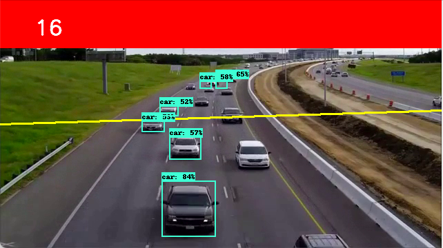

# counting_cars_tensorflow2.x_api
<h3>In this project i have configured the tensorflow2.x api to count the number of cars passing on the highway.</h3>

<h2>Links</h2>

[Tensorflow2.x  Api](https://github.com/tensorflow/models).

<h2>Model used </h2>
SSD Mobilenet v1

<h2>Dataset</h2>
COCO dataset

